# 🍽 MealToYou

### SSAFY 10기 자율 프로젝트 (2024.04.09~2024.05.20)

 

## 📗목차

1️⃣ [프로젝트 소개](#1-프로젝트-소개)  
2️⃣ [개발 환경](#2-개발-환경) 
3️⃣ [서비스 화면](#3-서비스-화면)  
4️⃣ [주요 기능](#4-주요-기능)  
5️⃣ [설계 문서](#6-설계-문서)  
6️⃣ [팀원 소개](#7-팀원-소개)  

## 1. 프로젝트 소개

#### 막막한 "식단 관리" MealToYou가 도와드립니다.

##### 스마트폰과 워치를 통해 하루를 기록해 보세요. 맞춤화된 식단 추천 서비스를 제공해 드립니다.

## 2. 개발환경

### 📚Tech Stack

#### Recommend and AI

 

#### Backend

#### Frontend

#### Database

#### Infra

#### IDE

#### Management Tool

 

## 3. 서비스 화면

#### 메인 페이지

| 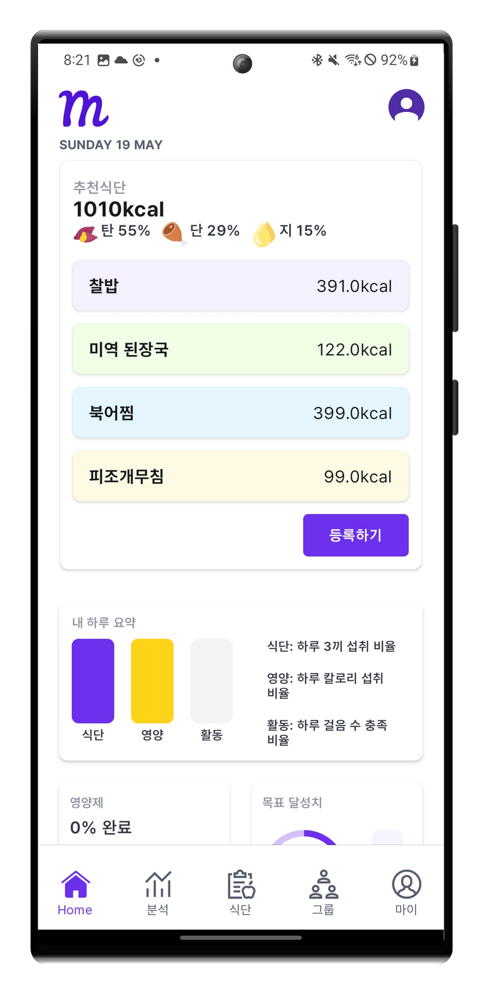 | 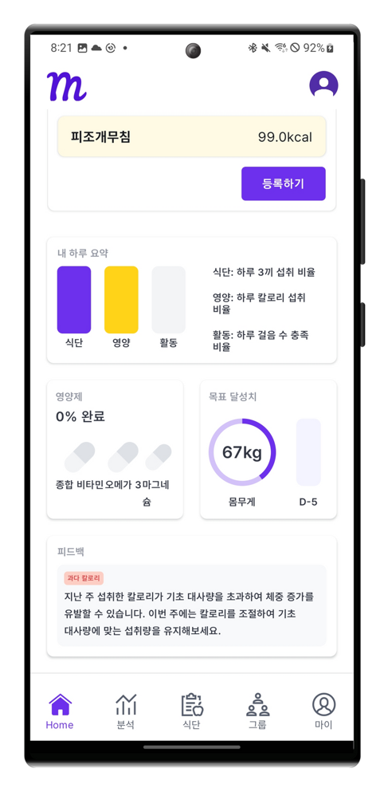 |
| :-----------------------------------------------------: | :-----------------------------------------------------: |
|          **식단 추천 사용자의 하루 요약 화면**          |       **영양제 관리 및 목표 관리 AI 피드백 화면**       |

#### 식단 등록

| 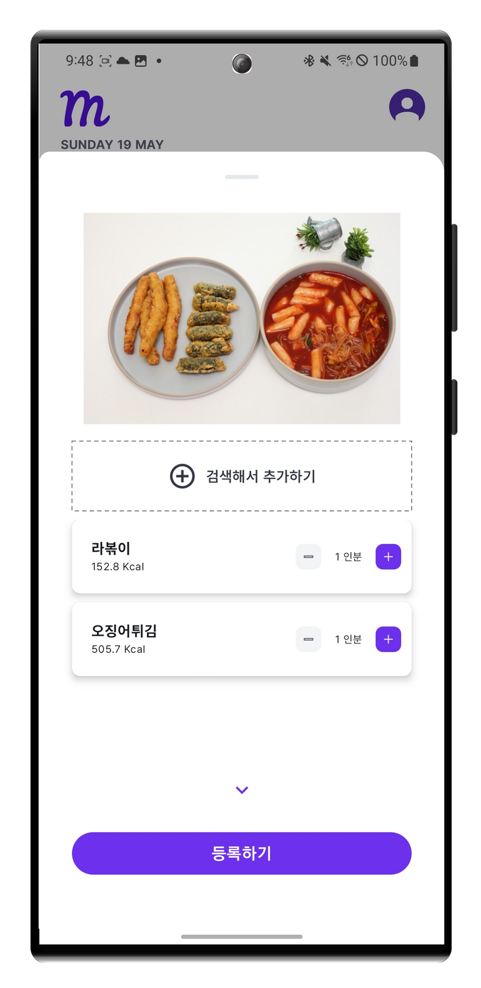 | 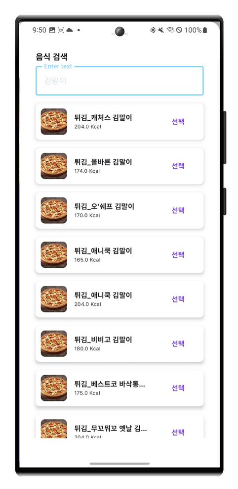 |
| :-----------------------------------------------------: | :-----------------------------------------------------: |
|        **사진 인식을 통한 음식 정보 입력 화면**         |             **검색을 통한 직접 입력 화면**              |

#### 그룹

| 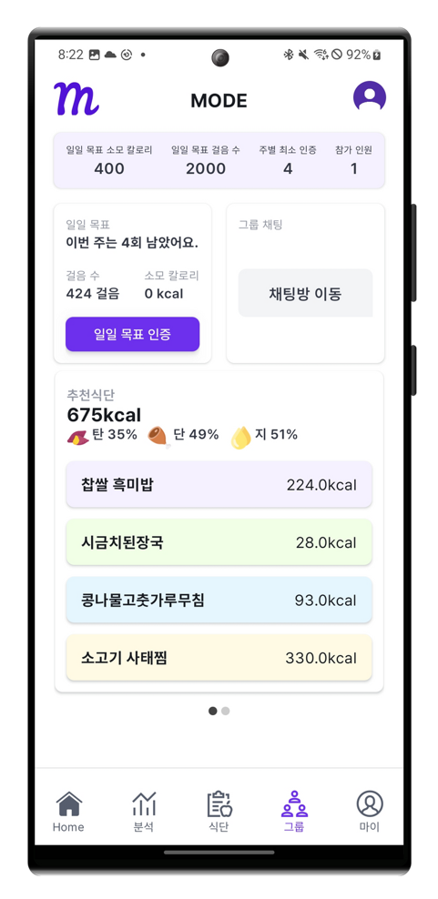 | 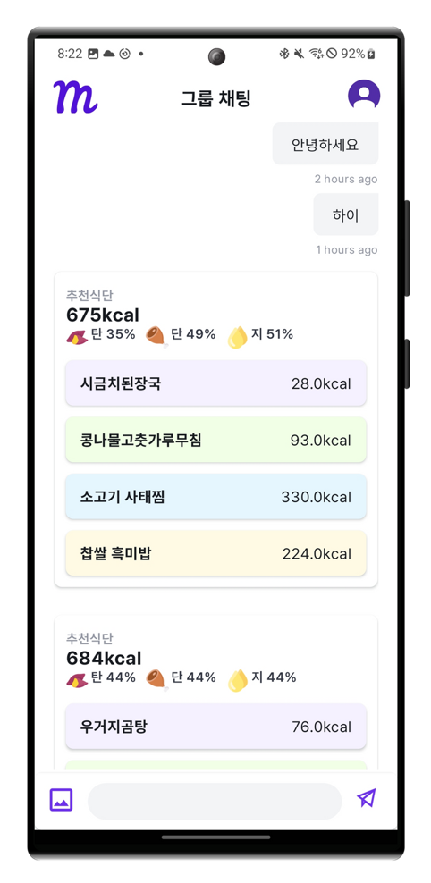 |
| :------------------------------------------------------: | :------------------------------------------------------: |
|            **목표 공유를 위한 커뮤니티 화면**            |         **채팅을 이용한 식단공유 및 인증 화면**          |

#### 마이페이지

| 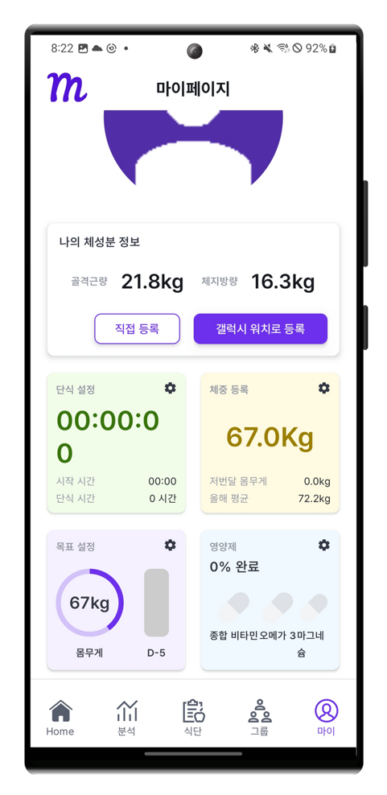 |
| :-------------------------------------------------------: |
|                **사용자의 정보 확인 화면**                |

#### 식단 목록

| 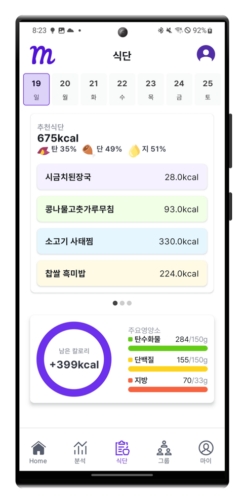 |
| :---------------------------------------------------------: |
|             **사용자의 일자별 식단 기록 화면**              |

#### 분석

| 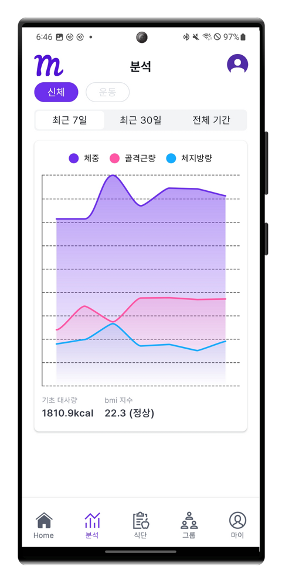 | 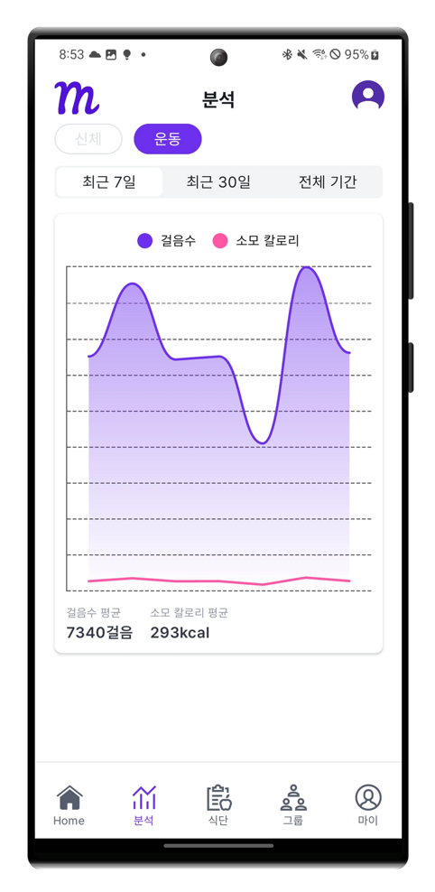 |
| :--------------------------------------------------------: | :--------------------------------------------------------: |
|             **사용자의 신체 데이터 요약 화면**             |             **사용자의 운동 데이터 요약 화면**             |

## 4. 주요 기능

#### 1. 식단 추천 서비스

##### 사용자의 소모칼로리, 식단기록을 통해 개인화된 식단 추천을 받을 수 있습니다.

#### 2. 식단 기록 및 분석 서비스

##### 사용자는 음식 인식, 검색을 통해 식단을 등록할 수 있습니다. 기록된 정보를 바탕으로 AI 피드백을 받을 수 있습니다.

#### 3. 워치 연동 신체정보 분석 서비스

##### 사용자는 워치를 통해 신체정보를 저장하고 이를 기반으로 한 분석 화면을 볼 수 있습니다.

#### 4. 커뮤니티 서비스

##### 사용자는 목표설정 후 커뮤니티 서비스를 통해 함께 목표를 이루어 나갈 수 있습니다. 채팅을 통해 매일 식단, 운동 인증을 할 수 있습니다.

#### 5. 알림 서비스

##### 영양제, 단식 시간을 설정하면 사용자에게 알림 서비스를 제공합니다.

## 5. 설계 문서

### ERD

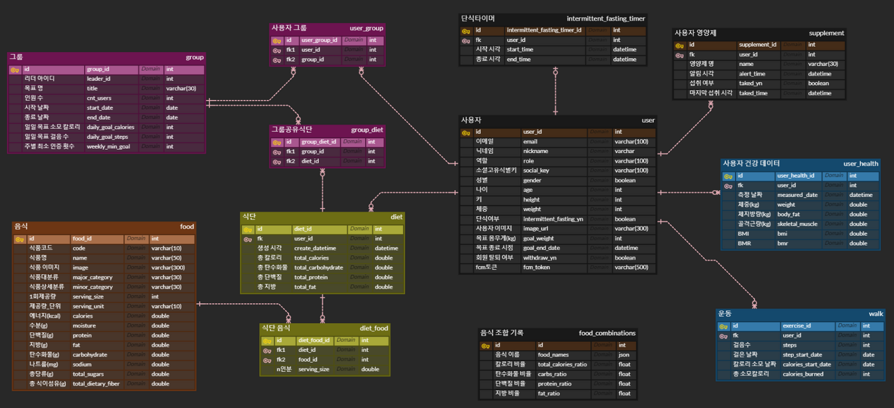

### 아키텍처 다이어그램

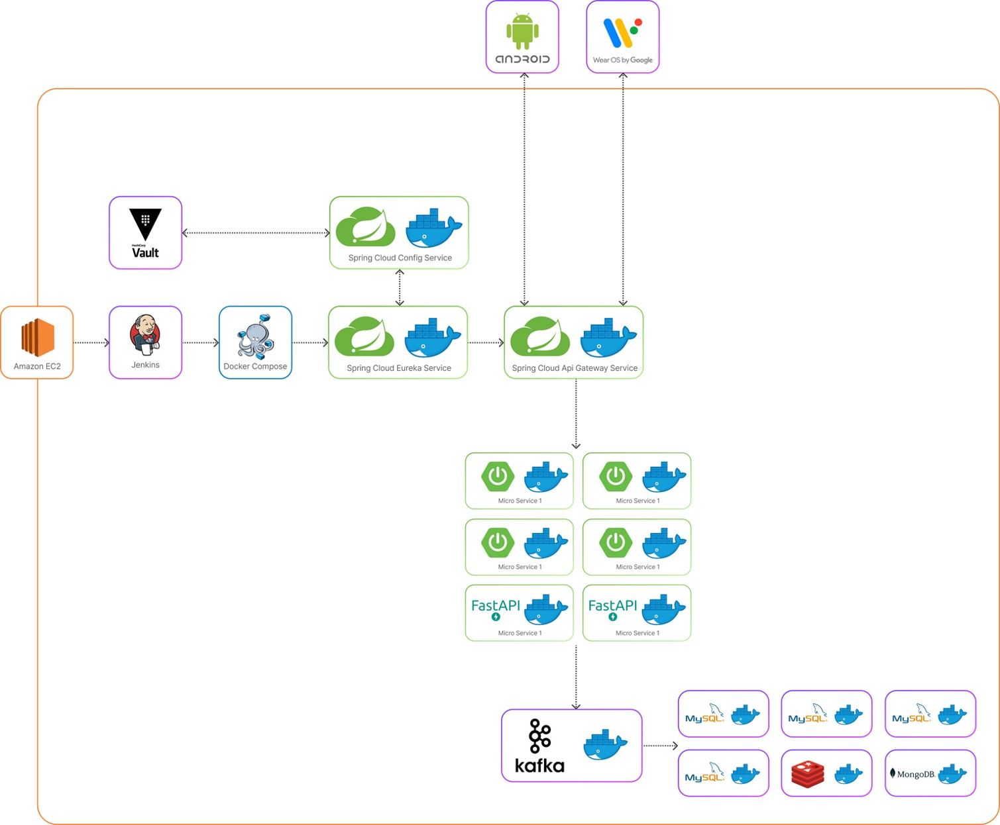

### API 명세

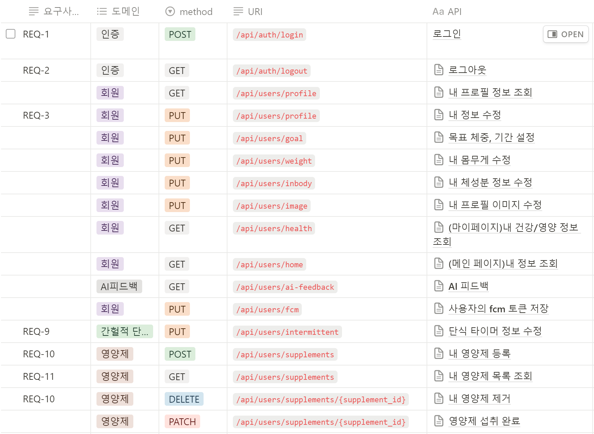
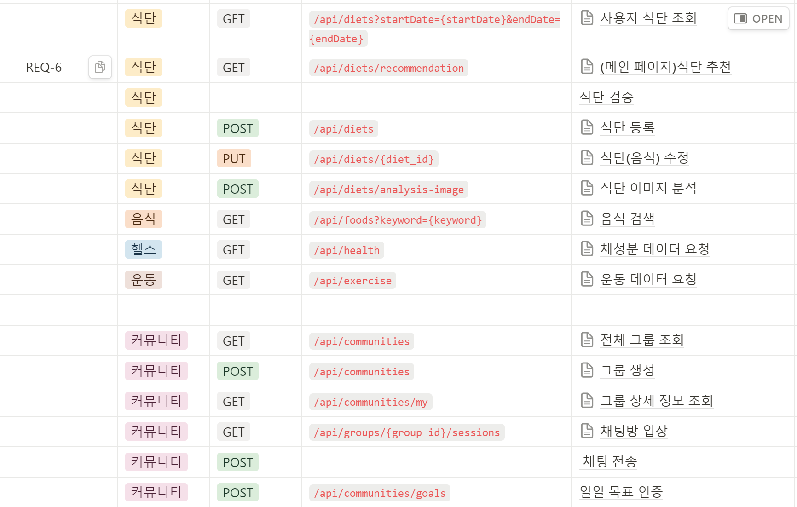

## 6. 팀원 소개

|                         팀장(주윤)                          |                         팀원(권순준)                          |                         팀원(김지민)                          |                         팀원(마성진)                          |                         팀원(조민균)                          |                         팀원(최지희)                          |
| :---------------------------------------------------------: | :-----------------------------------------------------------: | :-----------------------------------------------------------: | :-----------------------------------------------------------: | :-----------------------------------------------------------: | :-----------------------------------------------------------: |
|  |  | 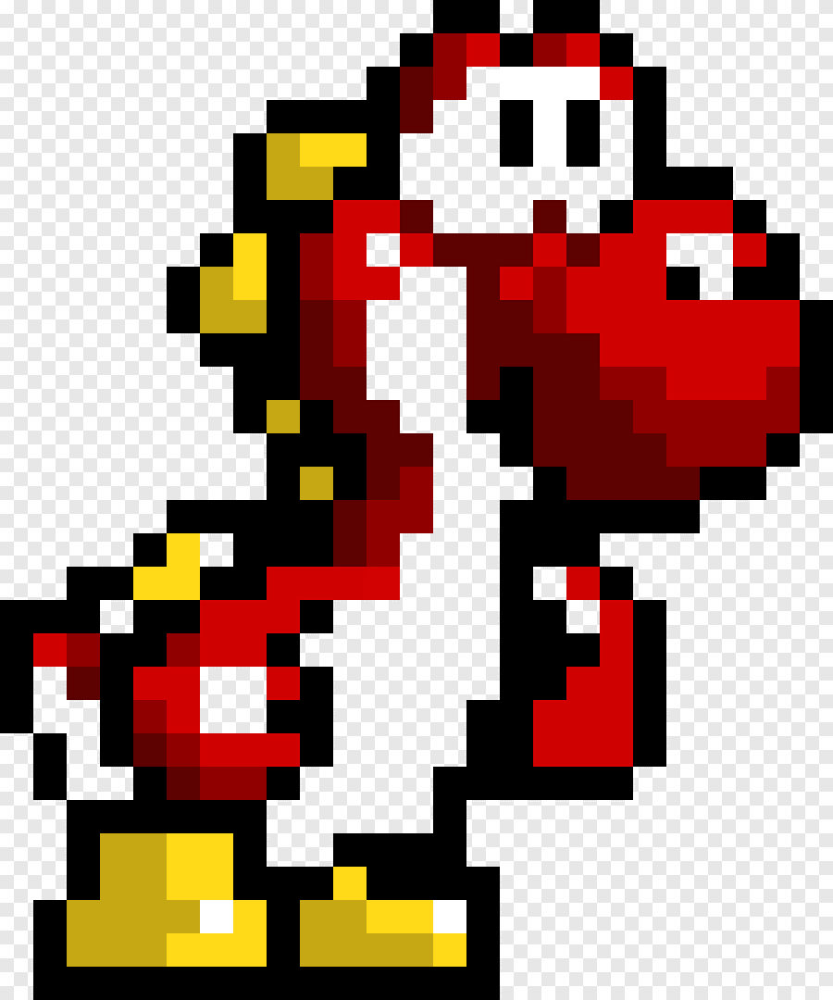 |  | 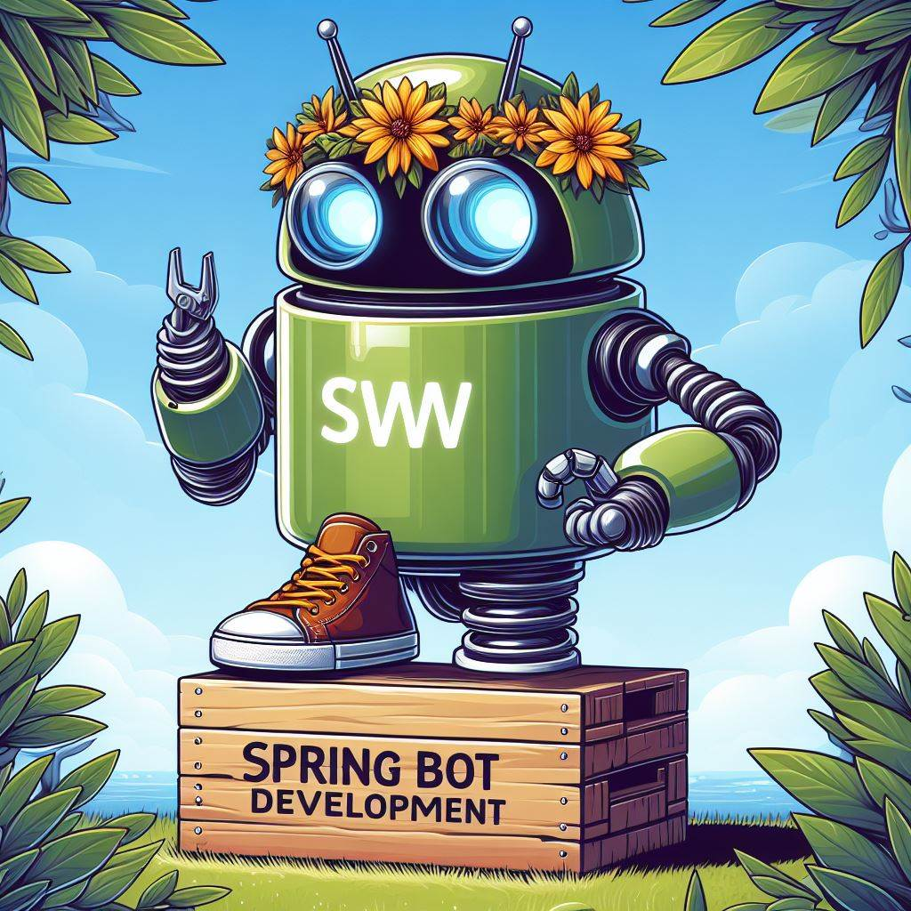 |  |
|                   **Android Backend**                   |             **Recommend Android Backend**             |                **AI Android Backend**                 |                    **Android Backend**                    |               **Android Backend Infra**               |                    **Android Backend**                    |
